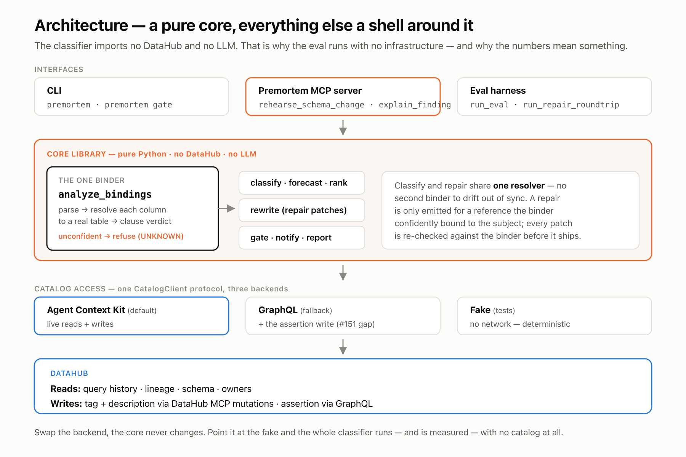

# Premortem

**how it breaks, before you merge**

Premortem is a schema-change rehearsal agent for [DataHub](https://datahub.com/).

When I propose renaming or dropping a column, Impact Analysis already tells me *what’s connected*. Premortem starts from that map and goes one layer deeper: it reads warehouse SQL from query history and forecasts *how* each consumer breaks — **hard**, **soft**, or **unknown** — then optionally writes the forecast back into the catalog so the next person (or agent) inherits it.

Built for the [DataHub Agent Hackathon](https://datahub.devpost.com/) (Apache-2.0).

**Demo page (no install):** [prasadt1.github.io/premortem-datahub](https://prasadt1.github.io/premortem-datahub/)

Primary user: a data engineer about to merge a column rename. Premortem composes with DataHub (library + MCP) — bring your own catalog for the live path; the frozen eval needs none.

## First 60 seconds

No DataHub, no Docker, no seeding — just Python 3.11+:

```bash
python3.11 -m venv .venv && source .venv/bin/activate
pip install -e ".[dev]"
pytest -q
python eval/run_eval.py
```

That reproduces the published numbers in [`eval/RESULTS.md`](eval/RESULTS.md): Premortem (binder) accuracy **0.97** (**39/40**, truncated), HARD precision **1.00** (n=15), decoy FP **0.00** (n=6). The frozen eval is the measurement; the live demo below is a constructed instance for the video.

## Merge gate (CI)

Make “before you merge” literal — exit code + JSON, no GitHub App:

```bash
premortem gate \
  --queries-dir path/to/sql \
  --rename order_status:order_state \
  --subject-table order_history \
  --tables-json eval/schema.json \
  --fail-on hard,unknown
```

Exit **0** when clean; **1** when any finding meets `--fail-on` (default `hard,unknown` so unparseable SQL cannot silent-pass); **2** if `--fail-on hard` alone would green-light unparseable input. Worked workflow: [`examples/ci/premortem-gate.yml`](examples/ci/premortem-gate.yml). Live: add `--live` (and drop `--queries-dir`) against your GMS.

## Repair plan

Same binder decisions drive SQL patches. Subject-bound HARD/SOFT → emit a rename diff; CLEARED, UNKNOWN, `SELECT *`, and ambiguous binding → **refuse** (no guessing on production SQL).

```bash
premortem --queries-dir eval/corpus --rename order_status:order_state \
  --subject-table order_history --tables-json eval/schema.json \
  --emit-patches /tmp/patches
python eval/run_repair_roundtrip.py   # 22/22 eligible; 18 refused
```

Sample diffs: [`examples/patches/`](examples/patches/). Live / MCP: `repairs[]` rides with the forecast; owners (who to warn) are listed in the forecast markdown from catalog `get_owners` — missing ownership is an honest empty list.

## Architecture

Layered architecture — a pure classifier core (no DataHub, no LLM), one binder shared by classify and repair, catalog access behind one `CatalogClient` protocol (Kit / GraphQL / Fake), DataHub at the edge.



## What you get

| Output | Meaning (remediation blast radius) |
|--------|--------------------------------------|
| **HARD** | Column in `WHERE` / `JOIN` / `GROUP BY` / `ORDER BY` / `HAVING` / window — repair can change row counts or results |
| **SOFT** | `SELECT`-list only — contained, mechanical rename downstream |
| **UNKNOWN** | Unparseable SQL, bare column still ambiguous after schema resolution, `SELECT *` — needs a human; never guessed |
| **UNAFFECTED** | No subject-bound reference — either **CLEARED** (the named subset: same-named column binds elsewhere; listed) or no query evidence of the column (count) |

Forecasts are ranked HARD → SOFT → UNKNOWN, composed under an Impact Analysis baseline (“N downstream dependents”), and emitted as markdown + JSON. I do **not** invent execution counts; `(exec×N)` appears only when the catalog actually provides them.

## See it against a live catalog

For the dual-MCP compose demo (local Quickstart + seed):

```bash
pip install -e ".[dev,datahub,mcp]"
python tools/seed_demo_environment.py
```

Then register both MCP servers ([`examples/MCP_COMPOSITION.md`](examples/MCP_COMPOSITION.md)) and ask an agent to rehearse renaming `order_status` → `order_state` on ORDER_HISTORY. Expect **DataHub Agent Context Kit** / DataHub MCP for schema/lineage/queries, Premortem `rehearse_schema_change` for the forecast + `write_payload`, and the host applying that payload as-is: **tag + description via DataHub MCP mutations; custom assertion via GraphQL** (OSS MCP Data Quality tools are DISABLED — [#151](https://github.com/acryldata/mcp-server-datahub/issues/151)). Result: Quality-tab assertion (`platform=premortem`) + `premortem_forecast` tag + description.

Live catalog default is the **DataHub Agent Context Kit** (`PREMORTEM_CATALOG=kit`). Explicit GraphQL fallback: `PREMORTEM_CATALOG=graphql` or `--catalog graphql`. The live path needs **query history** on the subject dataset (stock Quickstart does not; the demo seeder creates it).

## Usage

Classify one query:

```bash
premortem --sql-file tests/fixtures/queries/hard_where.sql --column order_status
```

Offline folder of SQL (optional user-supplied baseline is labeled in the report):

```bash
premortem --queries-dir tests/fixtures/queries \
  --rename order_status:order_state \
  --lineage-count 12 \
  --out examples/forecast-offline.md
```

Live against DataHub (measured baseline only — `--lineage-count` is rejected with `--live`):

```bash
premortem --live --rename order_status:order_state \
  --out examples/forecast-order-status.md \
  --json-out examples/forecast-order-status.json

premortem --live --drop order_status \
  --out examples/forecast-drop-order-status.md

premortem --live --rename order_status:order_state --write-back
```

Set `DATAHUB_GMS_URL` (default `http://localhost:8080`) and `DATAHUB_GMS_TOKEN` when your GMS requires auth. Live defaults to binder-only (`adjudicate=False`); `--adjudicate` is opt-in and net-negative on the frozen eval.

## Open-source contributions

Four issues filed from Quickstart / MCP integration friction (v1.5.0.6, `mcp-server-datahub` 0.6.0):

1. [`assertionRunEvent` rejects `schemaField` asserteeUrn](https://github.com/datahub-project/datahub/issues/18674) — column-scoped custom assertions cannot record run events on OSS
2. [Data Quality tools DISABLED on OSS MCP](https://github.com/acryldata/mcp-server-datahub/issues/151) — assertion mutations stay on GraphQL
3. [Documents create but often miss Quickstart search](https://github.com/datahub-project/datahub/issues/18675) — write-back visibility is assertion + tag + description instead
4. [`listQueries` empty until seeded + indexed](https://github.com/datahub-project/datahub/issues/18676) — populates after `createQuery`, not permanently broken

Details and versions: [`examples/OSS_ISSUES.md`](examples/OSS_ISSUES.md).

## Demo corpus

- [`examples/forecast-order-status.md`](examples/forecast-order-status.md) / [`.json`](examples/forecast-order-status.json)
- [`examples/forecast-drop-order-status.md`](examples/forecast-drop-order-status.md)
- Offline sample: [`examples/forecast-offline.md`](examples/forecast-offline.md)
- Live fallback seed: [`examples/seeded_queries.json`](examples/seeded_queries.json)
- Demo env seeder: [`tools/seed_demo_environment.py`](tools/seed_demo_environment.py)
- Camera assertion: [`examples/S2_ASSERTION.md`](examples/S2_ASSERTION.md)
- MCP composition (filming): [`examples/MCP_COMPOSITION.md`](examples/MCP_COMPOSITION.md)

Frozen classifier fixtures: `tests/fixtures/queries/`. Frozen eval (honest numbers): [`eval/RESULTS.md`](eval/RESULTS.md). Real-world observables (no labels): [HTML](https://prasadt1.github.io/premortem-datahub/real-world-run.html) · [markdown](https://github.com/prasadt1/premortem-datahub/blob/main/docs/real-world-run.md). Eval explorer: [prasadt1.github.io/premortem-datahub/eval-explorer.html](https://prasadt1.github.io/premortem-datahub/eval-explorer.html).

## Limits (honest)

- Not 100% breakage prediction — macros, dynamic SQL, and residual ambiguity land in **unknown**
- Alias shadowing / derived-table aliases / DML writes are **refused** (UNKNOWN, no patch) when the binder cannot scope them confidently — covered in `tests/`, not the frozen forty (see `eval/RESULTS.md` “Known blind spots”)
- No legal or compliance guarantees
- No query evidence ≠ safe to change
- Premortem reasons about **tables, not view expansion** — a CLEARED bind to `clients_daily` while the subject is `clients_daily_v6` is correct at the table level, but a rename still propagates if that name is a view over the subject
- The demo runs against a local DataHub Quickstart with the showcase-ecommerce datapack, extended with a synthetic `shipments` dataset, seeded query history, and seeded lineage. The accuracy numbers in [`eval/RESULTS.md`](eval/RESULTS.md) come from the frozen eval — not from this demo instance.
- Write-back ladder (rung 1): custom **assertion** (platform `premortem`) + **`premortem_forecast` tag** + description. Document create may succeed without UI indexing on Quickstart.
- OSS MCP: Data Quality mutation tools are DISABLED — assertion upsert stays on GraphQL / seeder; host still applies tag + description via DataHub MCP.
- When running a DataHub MCP server on camera, set `DATAHUB_TELEMETRY_ENABLED=false` so `track.datahubproject.io` timeouts do not scroll the logs

## License

Apache-2.0 — see [`LICENSE`](LICENSE).
